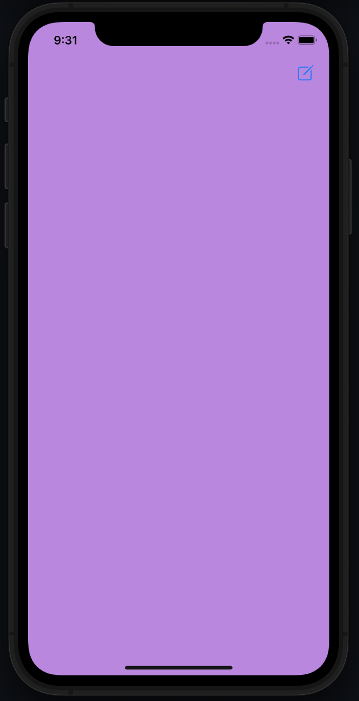
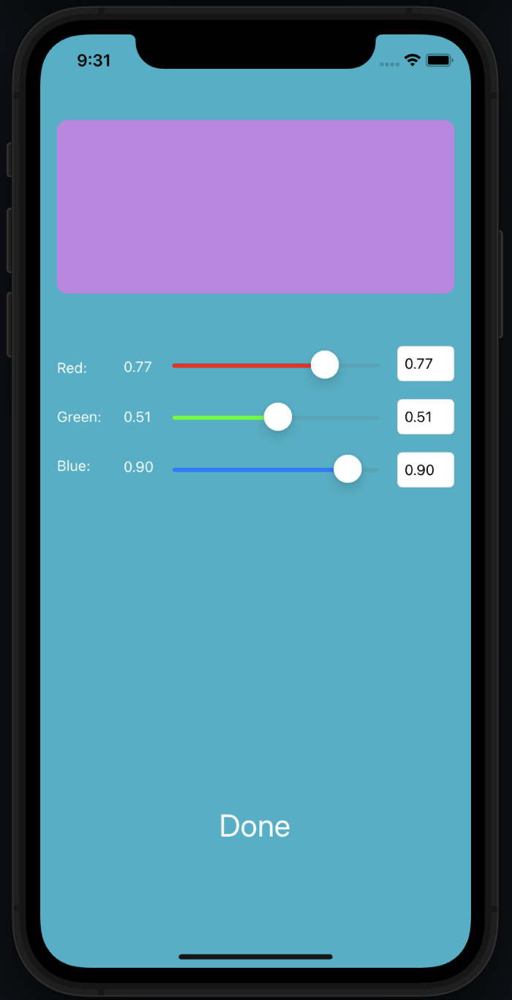

# Color-change

Color change - приложение для изменения цвета экрана с помощью настройки RGB слайдеров и текстовых полей на экране настроек.

# Интерфейс
1. Экран, для которого цвет фона можно установить в настройках. Экран настроек открываются нажатием на иконку справа сверху:

2. Экран настроек для изменения цвета фона предыдущего экрана:

# Используемый стек технологий
- Язык программирования - `Swift`
- Интерфейс - `UIKit`
- iOS 14+
